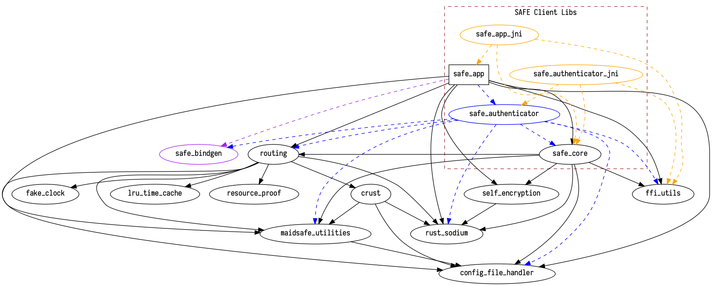

# cargo-deps

[](https://travis-ci.com/m-cat/cargo-deps)
[](https://crates.io/crates/cargo-deps)
[](https://crates.io/crates/cargo-deps)
[](https://github.com/m-cat/cargo-deps/issues)
[](https://github.com/m-cat/cargo-deps)
[](https://coveralls.io/github/m-cat/cargo-deps?branch=master)
[](https://opensource.org/licenses/MIT)

## About

Cargo subcommand for building dependency graphs of Rust projects.

This project is an improvement on the unmaintained and buggy [cargo-graph](https://github.com/kbknapp/cargo-graph).

Example:



## Installing

`cargo-deps` can be installed with `cargo install`:

```
cargo install cargo-deps
```

## Instructions

First, make sure you have [graphviz](https://graphviz.gitlab.io/download/) installed.

Next, just `cd` into the Rust project directory you want to graph and run:

```
cargo deps | dot -Tpng > graph.png
```

That's it! `graph.png` will contain the graph (you can change its name, of course!)

Note that `>` may not work if the output file already exists, in which case you can try `>|`.

### Dependency Kinds

The default behavior is to exclude optional, dev, and build dependencies. To see all dependencies, pass `--all-deps`:

```
cargo deps --all-deps | dot -Tpng > graph.png
```

Dependencies are colored depending on their kind:

* **Black:** regular dependency
* **Purple:** build dependency
* **Blue:** dev dependency
* **Red:** optional dependency

A dependency can be of more than one kind. In such cases, it is colored with the following priority:

```
Regular -> Build -> Dev -> Optional
```

For example, if a dependency is both a build and a dev dependency, then it will be colored as a build dependency. If, however, you pass the `--dev-deps` option instead of `--all-deps`, the dependency will be colored as a dev dependency (as the build-dependency graph will not be shown).

### Filtering

Some Rust projects have really big dependency trees and maybe you just want to display certain dependencies, like the ones in the same workspace. Fortunately, `cargo-deps` provides the `--filter` option for this use case. Unfortunately, you have to explicitly list all the dependencies you want to keep, and `cargo-deps` doesn't detect workspaces just yet.

#### Filtering transitive edges

For large dependency graphs, the `--no-transitive-deps` option can be used to filter out edges that are "covered" by a transitive dependency, which can make visual parsing a little easier by omitting some redundant edges. For example, if crate `A` depends directly on crate `B` and `C`, and crate `B` depends directly on crate `C`, this option would omit the edge from `A` to `C`. To illustrate, compare the [default dependency graph](tokei-default.png) for Tokei, generated by `cargo deps`, to the [graph with transitive edges removed](tokei-transitive.png), generated by `cargo deps --no-transitive-deps`.

### Subgraphs

You can visually group a set of dependencies by using the `--subgraph` command.

### Examples

**[Tokei](https://github.com/Aaronepower/tokei)** -- [graph](tokei.png)

This was generated using the command:

```
cargo deps -I --all-deps --no-regular-deps | dot -Tpng > tokei.png
```

**[SAFE Client Libs](https://github.com/maidsafe/safe_client_libs)** -- [graph](safe-client-libs.png)

This was generated using the following whopper of a command to display only MaidSafe dependencies:

```
cargo deps --all-deps --include-orphans --subgraph safe_app safe_app_jni safe_authenticator safe_authenticator_jni safe_core --subgraph-name "SAFE Client Libs" --filter accumulator config_file_handler crust ffi_utils fake_clock lru_time_cache maidsafe_utilities parsec resource_proof routing rust_sodium safe_app safe_app_jni safe_authenticator safe_authenticator_jni safe_bindgen safe_core safe_crypto safe_vault secure_serialisation self_encryption system_uri tokio_utp --manifest-path safe_app/Cargo.toml | dot -Tpng -Nfontname=Iosevka -Gfontname=Iosevka > safe-client-libs.png
```

### More info

Run `cargo deps -h` to see all available options.

## License

`cargo-deps` is released under the terms of the MIT license. See the [LICENSE-MIT](./LICENSE-MIT) file for the details.

## Dependencies


